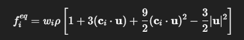

| Concept                 | Description                                                                                                                                                           | Analogy                                    |
| ----------------------- | --------------------------------------------------------------------------------------------------------------------------------------------------------------------- | ------------------------------------------ |
| **BlockLattice2D**      | A **single contiguous block** of cells (a regular 2D grid). All data is stored locally in one piece of memory.                                                        | Like one big sheet of graph paper.         |
| **MultiBlockLattice2D** | A **collection of several BlockLattice2D blocks**, stitched together logically to represent one big domain. Each block can live on a different thread or MPI process. | Like several tiles forming one big mosaic. |


- When to Use Which
    
    | Use Case                            | Which to Use          | Why                                 |
    | ----------------------------------- | --------------------- | ----------------------------------- |
    | Small test (like 100×100)           | `BlockLattice2D`      | Simpler, no communication overhead  |
    | Custom initialization               | `BlockLattice2D`      | Perfect for single-threaded setup   |
    | Real simulations                    | `MultiBlockLattice2D` | Enables MPI/OpenMP parallelism      |
    | You want to scale to multiple cores | `MultiBlockLattice2D` | Automatically partitions the domain |
    | Debugging physics logic             | `BlockLattice2D`      | Easier to see what’s happening      |
    | Production runs                     | `MultiBlockLattice2D` | Required for efficiency             |
- Summary Table
    | Feature                   | BlockLattice2D       | MultiBlockLattice2D            |
    | ------------------------- | -------------------- | ------------------------------ |
    | Memory                    | One contiguous block | Multiple sub-blocks            |
    | Parallelism               | None (single core)   | MPI + OpenMP capable           |
    | Communication             | Manual (none)        | Automatic halos & sync         |
    | Envelope                  | Optional             | Always present                 |
    | Best for                  | Testing & debugging  | Large-scale simulations        |
    | Code complexity           | Simple               | Needs management objects       |
    | applyProcessingFunctional | Works directly       | Works with automatic splitting |
- “Atomic” vs “MultiBlock”

    Remember from that doc paragraph:

    AtomicBlockXD = one contiguous chunk (single-core)

    MultiBlockXD = collection of blocks (parallelizable)
    | Type         | Atomic version       | Multi version             |
    | ------------ | -------------------- | ------------------------- |
    | Lattice      | `BlockLattice2D`     | `MultiBlockLattice2D`     |
    | Scalar field | `ScalarField2D`      | `MultiScalarField2D`      |
    | Tensor field | `TensorField2D<T,2>` | `MultiTensorField2D<T,2>` |
- `Cell<T, DESCRIPTOR>` 
    - ↳ contains $f_i$[ ] 
    - ↳ pointer to `Dynamics<T, DESCRIPTOR>`
    - The dynamics object controls how the cell collides (updates f_i)

- Different regions can have different dynamics (BGK, BounceBack, Smagorinsky, etc.)
  
| Dynamics Type              | Rulebook Summary                                          |
| -------------------------- | --------------------------------------------------------- |
| `BGKdynamics`              | Relax toward equilibrium with fixed ω                     |
| `SmagorinskyBGKdynamics`   | Relax with a *local ω*, depending on turbulence intensity |
| `NoDynamics`               | Do nothing (solid obstacle)                               |
| `BounceBack`               | Reflect incoming populations                              |
| `ExternalForceBGKdynamics` | Add body forces during collision                          |


| Function                                  | What it does                                                 |
| ----------------------------------------- | ------------------------------------------------------------ |
| `collide()`                               | Core physics: computes local viscosity & updates populations |
| `collideExternal()`                       | Same, but uses externally provided macroscopic fields        |
| `computeEquilibrium()`                    | Returns fᵢ^eq for a given (ρ, u)                             |
| `setOmega()`, `getOmega()`                | Control base relaxation rate                                 |
| `getDynamicParameter()`                   | Retrieve dynamic ω, ν, etc. per cell                         |
| `clone()`                                 | Needed for copying this dynamics polymorphically             |
| `serialize()`                             | For saving/loading simulation state                          |
| Members (`omega0`, `cSmago`, `preFactor`) | Store constants controlling turbulence modeling              |

```template<typename T, template<typename U> class Descriptor>
class IsoThermalBulkDynamics : public BulkDynamics<T,Descriptor> {
public:
    IsoThermalBulkDynamics(T omega_) : BulkDynamics<T,Descriptor>(omega_) { }
    
    virtual void collide(Cell<T,Descriptor>& cell, BlockStatistics& stats) {
        // Implementation of BGK or similar
    }
};
```
Why equilibrium (feq) is runtime-dependent

The equilibrium distribution is:


Every term depends on:

- ρ (density at that cell)

- u (velocity at that cell)

- Neither of those are known when you construct the Dynamics object,
- because that object is shared by many cells (it’s not unique per cell!).
```
Cell<T,Descriptor> cell;
cell.dynamics = &someGlobalDynamicsObject;
```
So if you have a lattice of 1 million cells,
they all share the same BGKdynamics or SmagorinskyBGKdynamics instance.

Therefore, you cannot store f_eq inside the dynamics object —
it would be different per cell, which defeats sharing.

Instead, equilibrium is computed on the fly, inside collide():
```
for (int iPop=0; iPop<Descriptor<T>::q; ++iPop) {
    T feq = this->computeEquilibrium(iPop, rho, u, uSqr);
    f[iPop] = f[iPop] - omega * (f[iPop] - feq);
}
```
***Summary Table*** 

| Concept                          | Where it’s computed      | Why                         |
| -------------------------------- | ------------------------ | --------------------------- |
| `omega`, `tau` (constants)       | constructor              | same for all cells          |
| `feq`, `ρ`, `u`                  | inside `collide()`       | depend on each cell’s state |
| `Descriptor` weights, velocities | static (at compile time) | same for all models         |
| `strain-rate tensor`, `forces`   | inside `collide()`       | local + time-varying        |

***🧩 6. Takeaway mental model***

    ✅ The constructor sets model constants (ω₀, Cₛ, etc.)

    🧮 The collide() method computes local state variables (ρ, u, f_eq)

    ⚙️ The parent class provides helper methods to compute those, but doesn’t store them

    🧠 The Dynamics object is shared among many cells, so it cannot hold per-cell quantities

    So you never compute f_eq in the constructor because:

    It’s not a fixed number — it’s different for every cell at every time step.

- Dynamics class only take 1 reference to the Cell

```
virtual void collide(Cell<T,Descriptor>& cell, BlockStatistics& stats);
```
- 💡 So what if you need neighbor information?

    1. Great question — that’s where data processors come in.

    2. Not all physics is local.
        For example:

        - computing gradients ∂u/∂x or ∂ρ/∂y

        - applying boundary conditions that depend on nearby cells

        - interpolating values between blocks

        - computing forces based on neighboring data

        - Those require multiple cells → non-local operations.

    3. In Palabos, such things are not done inside      Dynamics::collide(),
        because the collision code must remain purely local and fast.

    4. Instead, Palabos introduces processing functionals (or data processors) — functors that operate on a region (a box or a dot list) of the domain.

- How Palabos separates the two layers

    | Concept           | Scope                  | Typical use                                                         | Implemented as                                              |
    | ----------------- | ---------------------- | ------------------------------------------------------------------- | ----------------------------------------------------------- |
    | **Dynamics**      | Local (1 cell)         | Collision rule (BGK, Smagorinsky, etc.)                             | Class derived from `Dynamics<T,Descriptor>`                 |
    | **DataProcessor** | Non-local (many cells) | Apply external force, boundary condition, compute macroscopic field | Class derived from `BoxProcessingFunctional2D` (or similar) |

- Example: Collision (local)
    ``` 
    void SmagorinskyBGKdynamics::collide(Cell<T,Descriptor>& cell, BlockStatistics& stats) {
        // Uses only this cell
        T rho = cell.computeDensity();
        Array<T,Descriptor<T>::d> u;
        cell.computeVelocity(u);
        ...
    }
    ```

- Example: Force application (non-local)
  ``` 
  class AddBodyForce : public BoxProcessingFunctional2D_L<T,DESCRIPTOR> {
    public:
        AddBodyForce(Array<T,2> F_) : F(F_) { }

        void process(Box2D domain, BlockLattice2D<T,DESCRIPTOR>& lattice) override {
            for (plint iX=domain.x0; iX<=domain.x1; ++iX)
            for (plint iY=domain.y0; iY<=domain.y1; ++iY) {
                Cell<T,DESCRIPTOR>& cell = lattice.get(iX,iY);
                Array<T,2> u;
                T rho = cell.computeVelocity(u);
                u += F / rho; // modify velocity by external force
                cell.defineVelocity(u);
            }
        }
    };

    // calling 
    applyProcessingFunctional(new AddBodyForce<T,DESCRIPTOR>(F), lattice.getBoundingBox(), lattice);
    // This functor acts on many cells at once — that’s non-local behavior.
  ```
- Why Palabos enforces this separation
    
    | Reason                | Explanation                                                                                                                      |
    | --------------------- | -------------------------------------------------------------------------------------------------------------------------------- |
    | 🧬 **Physics clarity** | Collision must only depend on local cell properties → it models the relaxation term in the Boltzmann equation.                   |
    | ⚙️ **Performance**     | Keeping `collide()` local allows Palabos to parallelize it easily (each cell can update independently).                          |
    | 💻 **Architecture**    | Non-local things are encapsulated in *processing functionals*, which can be scheduled, combined, and parallelized automatically. |
    | 🔒 **Safety**          | If `collide()` could touch neighbors, you could easily cause race conditions during parallel streaming.                          |
- So the division of labor is:
    
    | Stage             | Responsible Class      | Scope                                 | Example                                  |
    | ----------------- | ---------------------- | ------------------------------------- | ---------------------------------------- |
    | Collision         | `Dynamics`             | Local (1 cell)                        | Relax fᵢ toward equilibrium              |
    | Streaming         | Palabos core engine    | Neighbor-dependent but handled safely | Moves fᵢ between cells                   |
    | Non-local effects | `ProcessingFunctional` | Multi-cell region                     | Apply forces, compute gradients, set BCs |
    | Initialization    | `ProcessingFunctional` | Multi-cell region                     | Initialize ρ and u fields                |
- 7. How this helps you as a developer

    When you write:

  - a custom Dynamics class → you define what each cell does locally

  - a custom ProcessingFunctional → you define what groups of cells do together

  - This division makes your simulation:

  - modular (each piece has one job)

  - parallel-safe

  - composable (you can combine many data processors without touching the collision code)

- ✅ 8. TL;DR Summary
    
    | Concept            | Meaning                                                                                 |
    | ------------------ | --------------------------------------------------------------------------------------- |
    | **Dynamics**       | Defines the local collision rule (purely local; acts on one cell)                       |
    | **Data Processor** | Defines non-local operations (acts on many cells, e.g. initialization, boundary forces) |
    | **Why separate?**  | Keeps physics modular, thread-safe, and parallelizable                                  |
    | **Rule of thumb**  | If you need neighbor info → use a processor, not dynamics                               |
