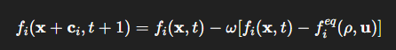

🧩 Understanding Dynamics, Streaming, and Boundary Conditions in Palabos

Palabos implements the Lattice Boltzmann Method (LBM) using a modular architecture that separates local physics from non-local operations.
This design makes the code easy to extend, parallelize, and reason about.

## ⚙️ 1. The Two Core Steps of LBM ## 

The discrete LBM update equation is:




This consists of two fundamental steps:
| Step          | Description                                                      | Type             | Implemented by       |
| ------------- | ---------------------------------------------------------------- | ---------------- | -------------------- |
| **Collision** | Update local populations ( $f_i$ ) toward equilibrium ( $f_i^{eq}$ ) | Local (per cell) | `Dynamics` class     |
| **Streaming** | Move ( $f_i$ ) to neighboring nodes along direction ( $c_i$ )        | Non-local        | Palabos lattice core |

## 🧠 2. Collision → Dynamics ##

The collision step is handled by a subclass of `Dynamics<T, Descriptor>.`

Each Dynamics object defines how a single cell behaves physically.
For example, BGKdynamics, SmagorinskyBGKdynamics, or a custom dynamics class you write.

```
virtual void collide(Cell<T,Descriptor>& cell, BlockStatistics& stats);
```


✅ Operates on one cell only
✅ Local in space
✅ Computes quantities like density ρ and velocity u
✅ Updates the cell’s populations 
$f_i$​


## ⚙️ 3. Streaming → handled by the lattice core ##

After all cells have collided, Palabos performs streaming automatically when you call:

`lattice.collideAndStream();`


Internally:
```
void MultiBlockLattice2D::collideAndStream() {
    collide();  // calls your dynamics for each cell
    stream();   // moves f_i to neighboring cells
}
```
Streaming moves post-collision populations 
$f_i^{post}$ to their neighbors.
It is fully parallel-safe and optimized by the Palabos core.

You never need to write this manually.

## 🧱 4. Boundary Conditions in Palabos

Different boundary types are handled by different mechanisms.
Most boundaries are implemented as specialized Dynamics classes.

### 🔹 4.1 Bounce-Back (no-slip wall)

Assigns a BounceBack dynamics to wall cells.

defineDynamics(lattice, wallDomain, new BounceBack<T,DESCRIPTOR>());


Implements:
$f_i^{post} = f_i^{pre}$

The halfway bounce-back condition is enforced locally in collide().

### 🔹 4.2 Zou–He Pressure/Velocity BC

Implemented using boundary processors that assign special dynamics internally:
```
setBoundaryVelocity(lattice, boundaryDomain, Array<T,2>(uX, uY));
```

This sets up VelocityBoundaryDynamics or PressureBoundaryDynamics,
which impose the Zou–He formula inside their collide() method.

### 🔹 4.3 Periodic Boundaries

Handled not by Dynamics, but by the lattice management layer:

```
setPeriodic(lattice, 0, true); // 0 → x-direction
```

The `MultiBlockManagement2D` layer wraps streaming so that
particles leaving one side reappear on the opposite side.

### 🔹 4.4 Custom / Complex Boundaries

When you need boundary logic involving multiple cells (e.g., curved walls, interpolated BCs),
you write a data processor (functor) derived from:

```
 BoxProcessingFunctional2D_L<T,DESCRIPTOR>
```

and apply it with:

``` 
applyProcessingFunctional(new MyBoundaryFunctional<T,DESCRIPTOR>(), box, lattice); 
```

## 🧩 5. Separation of Responsibilities
Concept	Scope	Typical Use	Implemented As
Dynamics	Local (1 cell)	Collision rule (BGK, Smagorinsky, bounce-back)	Derived from `Dynamics<T,Descriptor>`
Data Processor	Multi-cell (box or region)	Apply force, boundary setup, initialization	Derived from BoxProcessingFunctional2D
Streaming	Global	Moves 
$f_i$ between neighbors	Handled by lattice engine
Periodic BCs	
Global connectivity	Wraps domain edges	`MultiBlockManagement2D`

## 🧩 6. One Full Timestep in Palabos

When you call:

lattice.collideAndStream();


Palabos executes:

| Step | Action                                | Handler                       |
| ---- | ------------------------------------- | ----------------------------- |
| 1️⃣  | For every cell: `dynamics->collide()` | Your `Dynamics`               |
| 2️⃣  | Apply periodic wrapping (if enabled)  | `MultiBlockManagement`        |
| 3️⃣  | Stream populations to neighbors       | Palabos core                  |
| 4️⃣  | Update BCs (if post-processor active) | Data processors / BC functors |
| 5️⃣  | Compute macroscopic fields (optional) | Data processors / user code   |

```

                 +------------------------------+
                 |          Lattice             |
                 |  (MultiBlockLattice2D)       |
                 +------------------------------+
                         |          ^
                         | stream() |
                         v          |
                +--------------------------+
                |        Dynamics          |
                | (BGK, BounceBack, ...)   |
                +--------------------------+
                         |
                         | defines local collision
                         v
                +--------------------------+
                |       Cell (f_i[])       |
                +--------------------------+

     +--------------------------------------+
     |      Data Processors (non-local)     |
     |   - initialization                   |
     |   - boundary condition setup         |
     |   - forcing fields                   |
     +--------------------------------------+
```

## ✅ 8. Quick Summary
| Concept                 | Who Handles It                               | How                                 |
| ----------------------- | -------------------------------------------- | ----------------------------------- |
| **Collision**           | `Dynamics`                                   | Local per-cell operation            |
| **Streaming**           | Palabos core lattice (`MultiBlockLattice2D`) | Moves ( f_i ) to neighbors          |
| **Bounce-back BC**      | Specialized `Dynamics` (`BounceBack`)        | Local reflection rule               |
| **Zou–He BCs**          | Boundary functors + special dynamics         | Impose (ρ) or (u) on edges          |
| **Periodic BCs**        | `MultiBlockManagement`                       | Wrap lattice connectivity           |
| **Custom Forces / BCs** | User functors                                | Non-local `BoxProcessingFunctional` |
| **Initialization**      | Data processors                              | Multi-cell setup before loop        |

## 🧩 9. Mental Model Summary
Type	Example	Acts On	Parallel Behavior
Local	BGK, Smagorinsky, Bounce-back	1 cell	Trivially parallel
Non-local	Initialization, Zou–He, forcing	Multiple cells	Parallel via region decomposition
Infrastructure	Periodicity, streaming	Whole lattice	Handled by Palabos core

## 🚀 10. TL;DR

Dynamics = Local physics (per cell)
Streaming = Handled by lattice core
Boundaries = Special dynamics or processors
Periodicity = Lattice connectivity
Non-local stuff = Functors (data processors)

Everything that touches more than one cell goes into a processing functional.
Everything that touches exactly one cell goes into a dynamics.